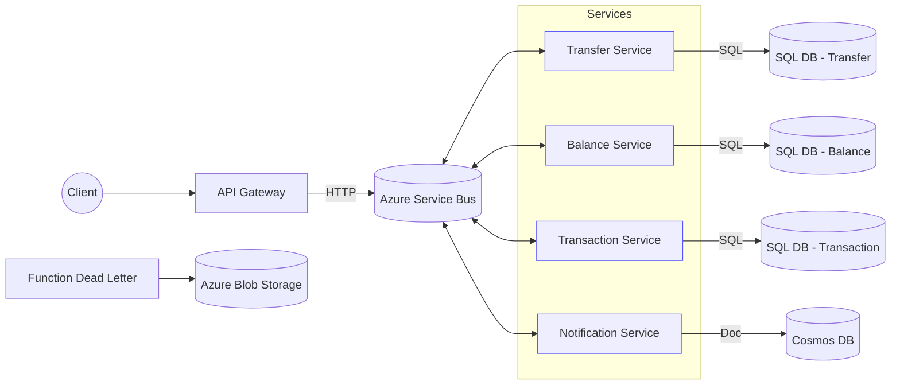

# Transferencia Bancaria – Microservicios en .NET 8 (Event‑Driven)

Solución end‑to‑end para **transferencias bancarias** basada en **microservicios y eventos**, con despliegue en **Azure** mediante **Terraform**. El sistema prioriza **seguridad**, **consistencia**, **resiliencia** y **observabilidad**.

> Servicios: **API Gateway**, **Transfer**, **Balance**, **Transaction**, **Notification**  
> Infraestructura: **Azure Service Bus (topics/subscriptions)**, **SQL (por servicio)**, **Cosmos DB**, **Azure Function (DLQ → Blob)**, **Key Vault**, **Tracing/Monitoring**.

---

## Objetivos del proyecto
  
- Diseñar e implementar **infraestructura en Azure con Terraform** para despliegues **seguros y escalables**.  
- Desarrollar microservicios en **.NET 8** utilizando **CQRS** y **SAGA**, DI y **comunicación por eventos**.  
- Implementar **seguridad y autenticación** con **Microsoft Entra ID** (JWT) detrás del **API Gateway**.  
- Implementar **comunicación asíncrona** con **tópicos** (publish/subscribe) para un acoplamiento débil.  
- Aplicar **compensaciones** y **manejo de fallos** (**SAGA + outbox/inbox + reintentos/DLQ**) para consistencia distribuida.  
- **Monitorear y observar** el sistema con telemetría, **logs centralizados** y **métricas** en Azure.

---

## Diagrama de infraestructura

> Si tu repo conserva la ruta `/docs/infra.png`, GitHub mostrará la imagen a continuación.


> Fallback en **Mermaid** si visualizas este README fuera de GitHub o sin la imagen disponible:



---

## Arquitectura (alto nivel)

- **API Gateway (.NET 8 + YARP/Ocelot)**: entrada única; auth, rate‑limit, trazas y enrutamiento.
- **Transfer Service (.NET 8 + CQRS + SAGA)**: orquesta la transferencia, publica `TransferInitiated` y coordina compensaciones.
- **Balance Service (.NET 8 + SQL)**: débitos/créditos idempotentes; control de concurrencia (optimistic concurrency).
- **Transaction Service (.NET 8 + SQL)**: registro contable y auditoría por operación.
- **Notification Service (.NET 8 + Cosmos DB)**: consumo de eventos y notificaciones por estado (creada/en proceso/éxito/fallo).
- **Azure Service Bus (Topics/Subscriptions)**: backbone de eventos; reintentos, DLQ.
- **Azure Function (Dead‑Letter Handler)**: procesa DLQ → **Azure Blob Storage** para análisis/rehidratación.
- **Key Vault**: secretos/connection strings.
- **Tracing/Monitoring**: OpenTelemetry → Application Insights / Log Analytics / Azure Monitor.

---

## Patrones y convenciones

- **CQRS** por servicio (Commands/Queries separados).
- **SAGA orquestada** (en `Transfer`): pasos + eventos + compensaciones.
- **Outbox/Inbox** por servicio (entrega al menos una vez, deduplicación).
- **Idempotencia** (`MessageId`, `OperationId`), **correlación** (`CorrelationId`, `traceparent`).
- **Versionado de contratos** (DTOs/Eventos: `v1`, `v2`, …).
- **Health checks** en `/health` (todos los servicios).

---

## Despliegue de infraestructura (Terraform en Azure)

### Prerrequisitos
- **Azure CLI** (`az login`)
- **Terraform** ≥ 1.6
- Suscripción de Azure con permisos suficientes

### Pasos
```bash
cd infra
terraform init
terraform workspace new dev || terraform workspace select dev

# Crea terraform.tfvars con tus valores:
# location = "eastus"
# project  = "bank-transfers"
# sku_sb   = "Standard"
# sql_admin_login    = "sqladmin"
# sql_admin_password = "P@ssw0rd_!"
terraform plan
terraform apply
```

**Recursos (orientativo):**
- Resource Group, (opcional) VNet
- **Service Bus** (namespace, topic, subscripciones, reglas)
- **SQL Server + DBs** (Balance/Transfer/Transaction)
- **Cosmos DB** (DB/Container p/ Notification/Outbox)
- **Storage Account** (Blob para DLQ)
- **Key Vault** (secretos)
- **Application Insights** / Log Analytics


---

## Seguridad y autenticación (Microsoft Entra ID)

- **Gateway protegido con JWT** (audience/scope).  
- Los servicios confían en encabezados verificados por el Gateway (propagación de claims y `traceparent`).

Variables de ejemplo:
```
ENTRA_TENANT_ID=<tenant>
ENTRA_CLIENT_ID=<app-registration-id>
ENTRA_AUDIENCE=api://bank-gateway
AUTH_AUTHORITY=https://login.microsoftonline.com/${ENTRA_TENANT_ID}/v2.0
```

---

## Configuración local (opcional)

Prerrequisitos: **.NET SDK 8**, **Docker Desktop**, **Cosmos DB Emulator** (o cuenta Azure), **Service Bus** (namespace real), **Azurite** para Blob.

Variables de entorno (ejemplo):
```
ASB_CONNECTION=Endpoint=sb://<namespace>.servicebus.windows.net/;SharedAccessKeyName=RootManageSharedAccessKey;SharedAccessKey=<key>
BALANCE_DB=Server=localhost,14331;Database=BalanceDb;User Id=sa;Password=Your_password123;Encrypt=False
TRANSFER_DB=Server=localhost,14332;Database=TransferDb;User Id=sa;Password=Your_password123;Encrypt=False
TRANSACTION_DB=Server=localhost,14333;Database=TransactionDb;User Id=sa;Password=Your_password123;Encrypt=False
COSMOS_CONN=AccountEndpoint=https://localhost:8081/;AccountKey=<key>;
COSMOS_DB=NotificationsDb
OTEL_EXPORTER_OTLP_ENDPOINT=http://localhost:4317
```

Arranque rápido (local):
```bash
# Infra mínima (sql + jaeger + azurite) – archivo a tu gusto
docker compose -f docker-compose.infra.yml up -d

# Migraciones (si usas EF Core)
dotnet ef database update --project src/Services/Balance
dotnet ef database update --project src/Services/Transfer
dotnet ef database update --project src/Services/Transaction

# Servicios
dotnet run --project src/ApiGateway
dotnet run --project src/Services/Transfer
dotnet run --project src/Services/Balance
dotnet run --project src/Services/Transaction
dotnet run --project src/Services/Notification
```

---

## Endpoints (ejemplo)

- **POST** `/api/transfers`
```json
{
  "fromAccount": "001-123",
  "toAccount": "002-987",
  "amount": 250.00,
  "currency": "USD",
  "reference": "Pago renta"
}
```
- **GET** `/api/accounts/{id}/balance`  
- **GET** `/api/transactions/{id}`  
- **GET** `/health`

---

## Observabilidad

- **OpenTelemetry** en todos los servicios (traces/metrics/logs).  
- Exportación a **Application Insights** (OTLP/Telemetry SDK).  
- **Log Analytics** para consultas KQL y paneles.  
- **Correlación** automática mediante `traceparent` y `CorrelationId`.

---

## Roadmap

- [ ] SAGA completa con compensaciones y timeouts  
- [ ] Outbox/Inbox productivo (EFCore + background publisher)  
- [ ] Reintentos exponenciales + políticas por subscripción (Service Bus)  
- [ ] CI/CD (GitHub Actions) con Terraform + despliegue de servicios  
- [ ] Alertas (App Insights/Monitor) + Dashboards KQL  
- [ ] Seeds y data de ejemplo

---

## Licencia

MIT (ajústala si tu organización lo requiere).
